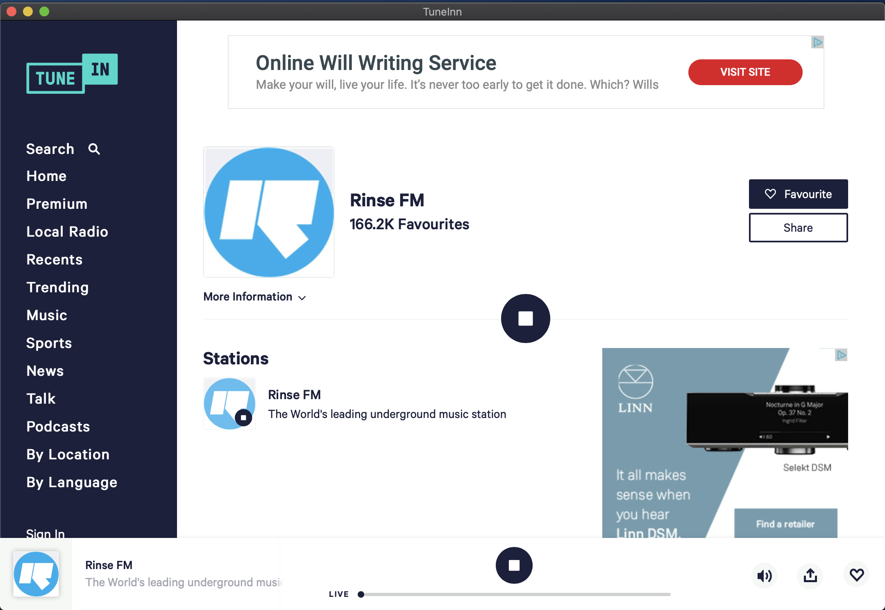

# TuneInn OSX App

- TuneInn is just a webview wrapper for tunein.com, why? because their mac app doesnt work with my touchbar!

There are a few very basic features included

- cmd + q (quit)
- cmd + r (reload)
- remember the last url when the app quits

# Install

- Drag `TuneInn.app` from this repo to your `Applications` folder

# Screenshots

## Using Pock

## Using Default OSX touchbar

